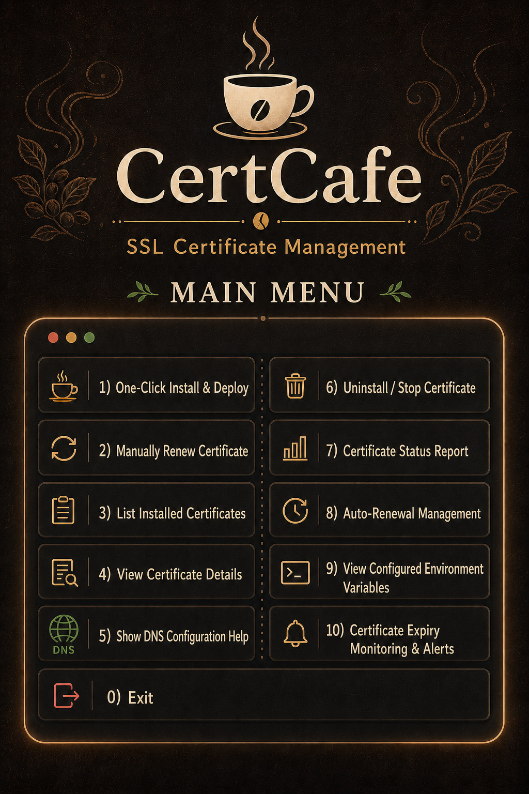

# CertCafe 🏷️ — Your SSL Certificate Café


[简体中文](README.md) | **English**

> ☕ A rich, freshly brewed SSL certificate solution for your daily needs.



## Table of Contents

- [Introduction](#introduction)
- [Features](#features)
- [Quick Start](#quick-start)
- [User Guide](#user-guide)
- [Domain Validation Methods](#domain-validation-methods)
- [DNS Provider Configuration](#dns-provider-configuration)
- [Certificate File Structure](#certificate-file-structure)
- [FAQ](#faq)
- [Advanced Usage](#advanced-usage)
- [Troubleshooting](#troubleshooting)
- [Automatic Renewal](#automatic-renewal)
- [Security Recommendations](#security-recommendations)
- [License](#license)
- [Contributing](#contributing)
- [Acknowledgements](#acknowledgements)

## Introduction

CertCafe is an elegant and powerful SSL certificate management tool built on [acme.sh](https://github.com/acmesh-official/acme.sh). Its simple, menu-driven interface makes requesting, installing, and renewing SSL certificates as pleasant as enjoying a cup of coffee.

### Design Principles

- **Easy to use:** Operate everything through menus without memorizing complex commands.
- **Multiple validation methods:** Supports DNS and HTTP validation (Standalone / Webroot).
- **Multi-platform support:** Works with the DNS APIs of major cloud providers.
- **Automation:** One-click installation, automatic renewal, and status monitoring.
- **Clear visibility:** Colorful terminal output and easy-to-read status reports.

## Features

### Signature Drinks (Core Features)

- ✅ **One-click installation and deployment** — Automatically installs acme.sh and configures certificates.
- ✅ **Two validation methods** — DNS and HTTP validation (Standalone / Webroot).
- ✅ **Multiple DNS providers** — Supports popular DNS services in China and worldwide.
- ✅ **Certificate type selection** — Supports RSA and ECC certificates.
- ✅ **Certificate renewal** — Renews individual certificates or all certificates at once.
- ✅ **Certificate inspection** — Lists certificates and displays detailed certificate information.
- ✅ **Current configuration overview** — Displays environment variables and masked DNS credential status.
- ✅ **Smart renewal management** — Provides both global and per-domain renewal controls.
- ✅ **Expiry monitoring and alerts** — Supports Telegram and SMTP notifications.

### International Flavors (Supported DNS Providers)

- ☁️ Cloudflare
- 📡 DNSPod
- 🐜 Alibaba Cloud
- 🐧 Tencent Cloud
- 🛡 Huawei Cloud
- 🐶 JD Cloud
- 🔧 Other custom DNS providers

### Certificate Capabilities

- 🔐 RSA and ECC certificate support
- 🌐 Multiple CAs: Let's Encrypt, ZeroSSL, and Buypass
- 🌍 DNS validation and HTTP validation (Standalone / Webroot)
- ⏰ Automatic renewal monitoring
- 📈 Certificate status reports

## Quick Start

### System Requirements

- Linux or Unix
- Bash shell
- `curl`
- **For DNS validation:** A valid domain and DNS provider API credentials
- **For HTTP validation:** A domain resolving to the current server, plus either public access to port 80 or an available website document root

### Installation

1. **Download the script**

```bash
# GitHub
curl -fsSL -o certcafe.sh https://raw.githubusercontent.com/Edward7x/certcafe/master/certcafe.sh

# Gitee (recommended for networks in mainland China)
curl -O https://gitee.com/edward7x/certcafe/raw/master/certcafe.sh

# Make the script executable
chmod +x certcafe.sh
```

2. **Run CertCafe**

```bash
./certcafe.sh
```

3. **Follow the menu prompts**

```text
======================================
        🏷️ CertCafe Main Menu
======================================
1) One-Click Install & Deploy
2) Manually Renew Certificate
3) List Installed Certificates
4) View Certificate Details
5) Show DNS Configuration Help
6) Uninstall / Stop Certificate
7) Certificate Status Report
8) Auto-Renewal Management
9) View Configured Environment Variables
10) Certificate Expiry Monitoring & Alerts
0) Exit
```

> The script's interactive interface is currently in Chinese. The English labels above correspond directly to menu options `0`–`10`.

## User Guide

### 1. One-Click Install & Deploy

This is the primary workflow and consists of the following steps.

#### Step 1: Select a Domain Validation Method

- **1) DNS validation:** Requires DNS provider API credentials and supports wildcard domains such as `*.example.com`.
- **2) HTTP validation:** Requires the domain to resolve to the current server. Two modes are available:
  - **Standalone:** Temporarily binds to port 80. Make sure no other service is using port 80 during issuance.
  - **Webroot:** Writes the challenge file to an existing website document root. A web server must already be running, and you must provide its document-root path, such as `/var/www/html`.

#### Step 2: Select a DNS Provider (DNS Validation Only)

| Option | Provider | Required Credentials |
| ------ | -------- | -------------------- |
| 1 | Cloudflare | API Token (recommended), or Global API Key + Email |
| 2 | Alibaba Cloud | AccessKey ID + Secret |
| 3 | Tencent Cloud | SecretId + SecretKey |
| 4 | DNSPod | ID + Key |
| 5 | Huawei Cloud | AccessKey ID + Secret Access Key |
| 6 | JD Cloud | AccessKey ID + Secret Access Key |
| 7 | Other | Manually configure `dns_xxx` and its environment variables |

If DNS environment variables are already present in the current shell, CertCafe detects them first and asks whether to reuse them, avoiding repeated credential entry.

#### Step 3: Configure Domains

- **Primary domain:** For example, `example.com`
- **Additional domains:** Separate multiple domains with spaces; wildcard domains are supported.
- Example: `example.com *.example.com www.example.com`
- CertCafe submits the primary and additional domains together so acme.sh issues one certificate containing all requested Subject Alternative Names (SANs).

#### Step 4: Select a Certificate Type

- **RSA:** Broad compatibility; recommended for legacy systems.
- **ECC:** Strong security with smaller keys; recommended for modern clients.

#### Step 5: Select a Certificate Authority

- **Let's Encrypt** (default): Free certificates valid for 90 days.
- **ZeroSSL:** Free certificates valid for 90 days.
- **Buypass:** Free certificates valid for 180 days.

When ZeroSSL is selected, CertCafe requests a valid email address to register or update the ZeroSSL account. You may also provide an ACME account email while installing acme.sh; leave it blank to skip.

#### Step 6: Configure Automatic Renewal

By default, CertCafe enables acme.sh's global cron renewal task. Disabling renewal during issuance removes that cron task while preserving all certificates and their management records.

#### Step 7: Install the Certificate

CertCafe issues the certificate and can install it into a directory of your choice.

### 2. Manually Renew Certificates

1. Select main-menu option `2`.
2. Choose one of three renewal modes:
   - **Renew all certificates:** Renews every installed certificate.
   - **Renew a specified domain:** Renews only the selected domain.
   - **Force renewal:** Ignores the current validity period and requests a new certificate immediately.

### 3. List Certificates

1. Select main-menu option `3`.
2. Review installed certificates, including domains, certificate paths, expiry dates, and totals.

### 4. View Certificate Details

1. Select main-menu option `4`.
2. Enter the domain to inspect.
3. Review file locations, validity dates, issuer, and Subject Alternative Names (SANs).

### 5. DNS Configuration Help

1. Select main-menu option `5`.
2. Review detailed API configuration guidance for supported DNS providers.

### 6. Uninstall or Stop Certificates

1. Select main-menu option `6`.
2. Choose an action:
   - Delete one certificate.
   - Delete all certificates.
   - Manage automatic renewal while retaining certificates.

### 7. Certificate Status Report

1. Select main-menu option `7`.
2. Review each certificate's:
   - Expiry date
   - Remaining days
   - Renewal status
   - Summary statistics

### 8. Auto-Renewal Management

CertCafe provides both a global switch and per-domain controls:

1. Select main-menu option `8`.
2. Enable or disable the global cron renewal task.
3. Open the per-domain renewal manager to inspect RSA/ECC certificate status and enable or pause renewal for an individual primary domain.

The global cron task is the master switch. When it is disabled, no certificates renew automatically. When it is enabled again, domains that were individually paused remain paused. Per-domain pausing uses acme.sh's native `.conf.removed` mechanism; certificates, private keys, and installed files are retained and can later be restored from the same menu.

### 9. View Configured Environment Variables

Inspect the validation method and credential status in the current session. Sensitive values are masked.

1. Select main-menu option `9`.
2. Review:
   - The current `DNS_PROVIDER` value
   - Whether each DNS provider credential is configured, displayed as `***SET***` or `Not set`
   - Path settings such as `ACME_INSTALL_DIR`

### 10. Certificate Expiry Monitoring & Alerts

Select main-menu option `10` to configure expiry alerts. Supported capabilities include:

- A configurable advance-warning period, defaulting to 30 days
- Telegram Bot notifications
- SMTP/SMTPS email notifications
- Test alerts
- Immediate expiry checks
- A daily monitoring cron task scheduled for `09:15`

Monitoring settings are stored in `~/.certcafe/monitor.conf` with file permissions set to `600`. CertCafe sends only one alert for a certificate at a given expiry timestamp. After renewal changes the expiry date, alerts become eligible again automatically.

#### Telegram Configuration

1. Create a bot through `@BotFather` and obtain its Bot Token.
2. Send a message to the bot.
3. Obtain the Chat ID for the target user, group, or channel.
4. Select **Configure/Enable Telegram** from the monitoring menu and enter the Bot Token and Chat ID.
5. Use **Send Test Alert** to verify the configuration.

#### Email Configuration

Email alerts use curl's SMTP support and require:

- An SMTP URL, such as `smtps://smtp.example.com:465` or `smtp://smtp.example.com:587`
- An SMTP username
- An SMTP password or app-specific authorization code
- Sender and recipient email addresses

Use an app-specific SMTP authorization code supplied by your email provider instead of your web-login password.

#### Non-Interactive Check

Run the same monitoring check used by cron manually:

```bash
./certcafe.sh --check-alerts
```

## Domain Validation Methods

CertCafe supports two methods for proving domain ownership:

| Method | Description and Use Cases |
| ------ | ------------------------- |
| **DNS validation** | Uses the DNS provider API to create a TXT record automatically. Supports wildcard certificates such as `*.example.com` and does not require port 80 to be open on the local server. |
| **HTTP validation** | The CA requests `http://your-domain/.well-known/acme-challenge/`. The domain must resolve to the current server and be publicly reachable. **Standalone** temporarily listens on port 80; **Webroot** places the challenge file under an existing website document root. |

- After choosing **DNS validation**, select a DNS provider and enter its API credentials.
- After choosing **HTTP validation**, select Standalone or Webroot. Webroot also requires the website document-root path.

## DNS Provider Configuration

### Cloudflare

1. Sign in to the Cloudflare dashboard.
2. Go to **My Profile → API Tokens**.
3. Create an API Token with at least `Zone:Read` and `DNS:Edit`; restrict it to only the zones that require certificates when possible.
4. Optionally provide a Zone ID so CertCafe can operate on the exact zone and avoid automatic-detection failures.
5. For backward compatibility, you may use a Global API Key + Email, but this is not recommended for new configurations.

### Alibaba Cloud

1. Sign in to the Alibaba Cloud console.
2. Open **Resource Access Management (RAM)**.
3. Create a RAM user and grant `AliyunDNSFullAccess`.
4. Create an AccessKey.

### Tencent Cloud

1. Sign in to the [Tencent Cloud console](https://console.cloud.tencent.com/cam/capi).
2. Go to **Cloud Access Management → API Key Management**.
3. Create or use an existing key and obtain the **SecretId** and **SecretKey**.

### DNSPod

1. Sign in to the DNSPod console.
2. Go to **Account Center → API Keys**.
3. Create an API token.
4. Obtain the **ID** and **Token** (`DP_Id` and `DP_Key`).

### Huawei Cloud

1. Sign in to the Huawei Cloud console.
2. Open **Identity and Access Management (IAM)**.
3. Create a user and grant `DNS FullAccess`.
4. Create an access key.

### JD Cloud

1. Sign in to the JD Cloud console.
2. Go to **Access Control → User Management**.
3. Create a sub-user or use an existing user.
4. Grant the user `JDCloudDNSFullAccess`.
5. Create an AccessKey under **AccessKey Management**.
6. Enter the AccessKey ID and Secret Key in CertCafe.

### General Permission Requirements

Every DNS provider requires the corresponding API permissions:

- Domain/DNS zone management
- DNS record modification
- API access

## Certificate File Structure

After installation, certificate files are typically located at:

```text
/etc/ssl/your-domain.com/
├── cert.pem          # Certificate
├── key.pem           # Private key
└── fullchain.pem     # Full certificate chain
```

The acme.sh working directory is typically:

```text
~/.acme.sh/
├── your-domain.com/  # Domain certificate directory
├── account.conf      # Account configuration
└── acme.sh           # Main program
```

## FAQ

### Q: The script is not executable

**A:** Grant execute permission:

```bash
chmod +x certcafe.sh
```

### Q: DNS validation fails

**A:** Check that:

- ✅ The DNS API credentials are correct.
- ✅ DNS changes have propagated.
- ✅ The network connection is working.
- ✅ The cloud-provider account has sufficient permissions.

### Q: HTTP validation fails

**A:** Check that:

- ✅ The domain resolves to this server and `http://your-domain/.well-known/acme-challenge/` is publicly reachable.
- ✅ **Standalone:** Port 80 is available. Temporarily stop Nginx, Apache, or any other process using it before issuance.
- ✅ **Webroot:** The website document root is writable, the web server is running, and the challenge path is served correctly.
- ✅ The network and firewall allow inbound traffic on port 80.

### Q: Certificate installation fails

**A:** Check that:

- ✅ The destination directory is writable.
- ✅ Sufficient disk space is available.
- ✅ SELinux or AppArmor is not blocking the operation.

### Q: Automatic renewal does not work

**A:** Check that:

- ✅ The cron service is running.
- ✅ Certificate directory permissions are correct.
- ✅ The acme.sh log does not report an error.

### Q: The `curl` command is missing

**A:** Install it using your distribution's package manager:

```bash
# Ubuntu/Debian
apt-get install curl

# CentOS/RHEL
yum install curl
```

### Q: How do I uninstall acme.sh manually?

```bash
~/.acme.sh/acme.sh --uninstall
rm -rf ~/.acme.sh
```

> The second command permanently removes the acme.sh working directory. Back up any required certificates and keys first.

## Advanced Usage

### Wildcard Certificates

Use a wildcard while entering domains. Wildcard certificates require **DNS validation**; HTTP validation does not support them.

```text
Primary domain: example.com
Additional domains: *.example.com
```

CertCafe submits both names to acme.sh and issues one certificate covering `example.com` and `*.example.com`.

### Multi-Domain Certificates

Request one certificate covering several domains:

```text
Primary domain: example.com
Additional domains: www.example.com api.example.com shop.example.com
```

### Custom Installation Directory

Specify a custom destination while installing the certificate:

```text
Default: /etc/ssl/example.com/
Custom:  /usr/local/nginx/ssl/example.com/
```

## Troubleshooting

### View Logs

```bash
tail -f ~/.acme.sh/acme.sh.log
```

### Enable Detailed Debug Output

```bash
# Debug DNS validation
~/.acme.sh/acme.sh --issue --dns dns_cf -d example.com --debug

# Debug HTTP Standalone validation
~/.acme.sh/acme.sh --issue --standalone -d example.com --debug

# Debug HTTP Webroot validation
~/.acme.sh/acme.sh --issue -d example.com -w /var/www/html --debug
```

### Test DNS Resolution

```bash
dig example.com
nslookup example.com
```

### Check API Permissions

Make sure the API key has sufficient DNS-management permissions.

## Automatic Renewal

CertCafe configures certificate renewal automatically:

- 📅 Checks certificate validity automatically
- 🔔 Begins renewal attempts 30 days before expiry
- 📝 Records renewal logs
- 🚨 Supports Telegram and SMTP expiry alerts

Automatic renewal relies on a global cron task installed by acme.sh. This task checks every certificate that has not been paused. It is enabled by default during issuance and can be disabled when prompted. You can later control the global task from **Auto-Renewal Management**, or enable and pause individual primary domains. If automatic configuration fails, install the cron task manually:

```bash
~/.acme.sh/acme.sh --install-cronjob
```

## Security Recommendations

1. **Protect API keys:** Store DNS API credentials securely.
2. **Apply least privilege:** Grant API keys only the permissions they require.
3. **Rotate credentials regularly:** Replace API keys periodically.
4. **Monitor certificate status:** Check certificate validity and renewal status regularly.
5. **Back up private keys:** Keep secure backups of certificate private keys.

## License

This project is open source under the [MIT License](LICENSE).

## Contributing

Issues and pull requests are welcome.

## Acknowledgements

Thanks to:

- [acme.sh](https://github.com/acmesh-official/acme.sh) — An excellent ACME client
- All supported DNS providers
- Open-source community contributors

---

**CertCafe** — SSL certificate management as simple and enjoyable as a cup of coffee. ☕✨

*Last updated: August 2026*
